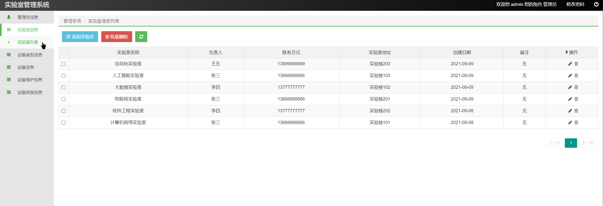
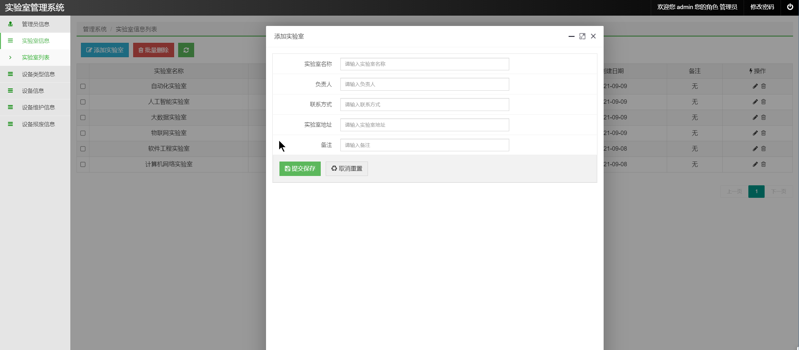
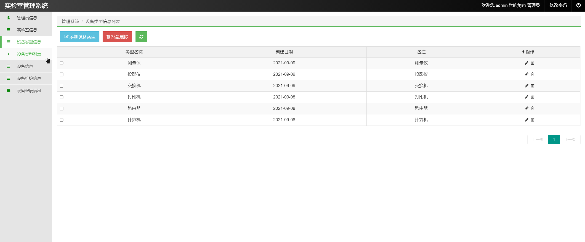
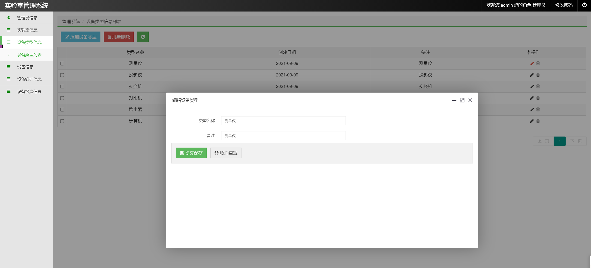
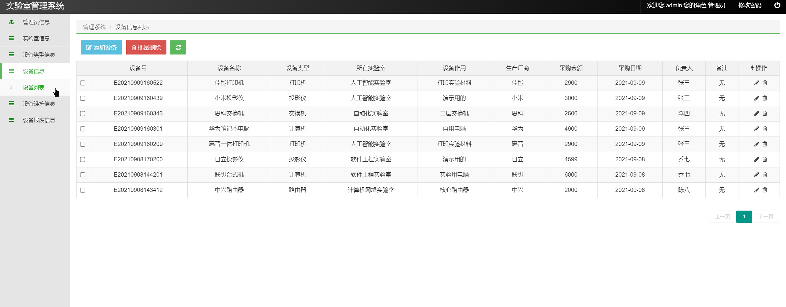
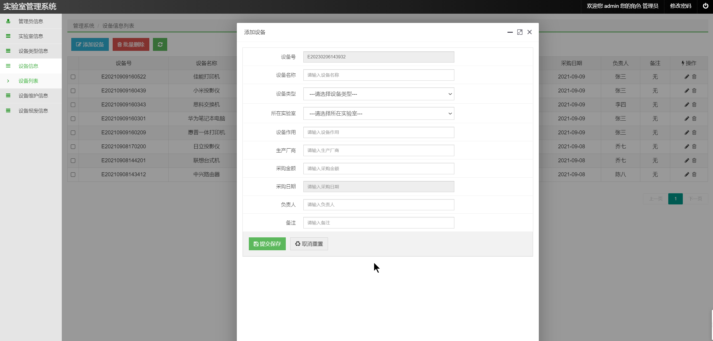
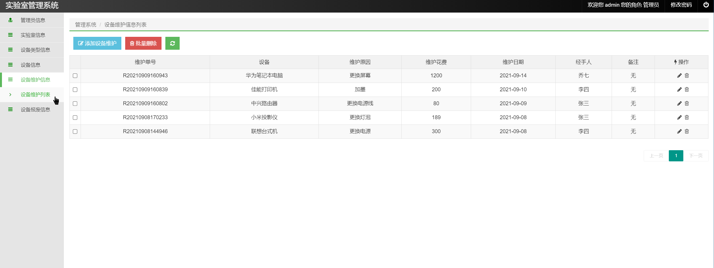
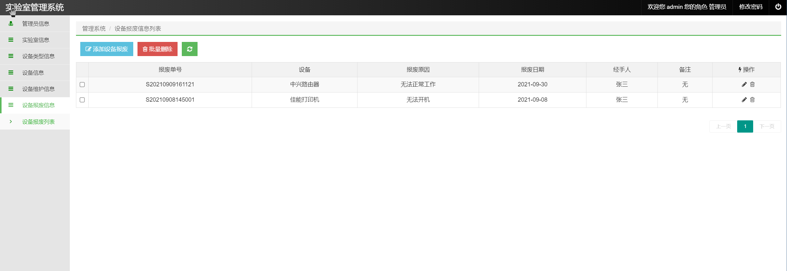

## 基于SSM实现的设备管理系统

- <b>完整代码获取地址：从戎源码网 ([https://armycodes.com/](https://armycodes.com/))</b>
- <b>技术探讨、资料分享，请加QQ群：692619798</b> 
- <b>作者微信：19941326836  QQ：952045282</b> 
- <b>承接计算机毕业设计、Java毕业设计、Python毕业设计、深度学习、机器学习</b>
- <b>选题+开题报告+任务书+程序定制+安装调试+论文+答辩ppt 一条龙服务</b>
- <b>所有选题地址 ([https://github.com/YuLin-Coder/AllProjectCatalog](https://github.com/YuLin-Coder/AllProjectCatalog)) </b>

## 项目介绍
基于SSM实现的设备管理系统（实验室设备管理系统），本设备管理系统主要包含以下功能模块：
1.系统功能
系统登陆、修改密码、退出
2.管理员管理
管理员列表、添加管理员、修改管理员、删除管理员、批量删除等
3.实验室管理
实验室列表、添加实验室、修改实验室、删除实验室、批量删除等
4.设备类型管理
设备类型列表、添加设备类型、修改设备类型、删除设备类型、批量删除等
5.设备管理
设备列表、添加设备、修改设备、删除设备、批量删除等
6.设备维护管理
设备维护列表、添加设备维护、修改设备维护、删除设备维护、批量删除等
7.设备报废管理
设备报废列表、添加设备报废、修改设备报废、删除设备报废、批量删除等

## 项目技术
- 编程语言：Java
- 数据库：MySQL
- 前端技术：Layui、Vue（前后端分离）
- 后端技术：Spring、SpringMVC、MyBatis

## 运行环境
- JDK版本：JDK1.8及以上
- 开发工具：IDEA、Ecplise、Myecplise都可以
- 数据库: MySQL5.7及以上

## 运行截图

